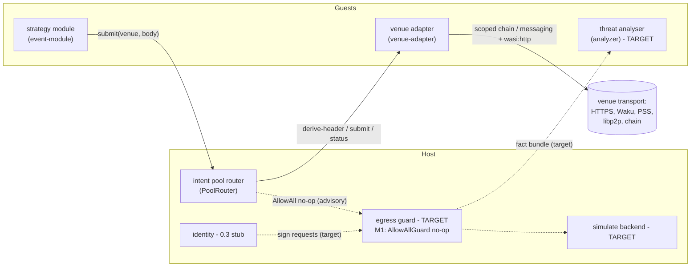
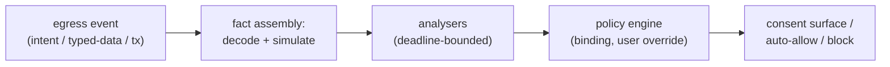

# Intent Architecture: Venue Adapters and the Egress Guard

> Historical document from the pre-carve monorepo, nullislabs/shepherd commit `23aa95d`, path `docs/09-intent-architecture.md`; the port applies path fixups and ASCII normalization only, and its issue, PR, ADR, decision, crate, and path references are all pre-carve. Its cross-document links became plain names, because this repository does not hold the documents they pointed at.
>
> Retired claims, load-bearing only, not exhaustive:
> - The package names are pre-carve throughout. `nexum:value-flow@0.1.0` is `videre:value-flow@0.1.0` in `wit/videre-value-flow/types.wit`, `nexum:intent@0.1.0` split into `videre:types@0.1.0` (`wit/videre-types/types.wit`) and `videre:venue@0.1.0` (`wit/videre-venue/venue.wit`), and `nexum:adapter@0.1.0` folded into `videre:venue`. Read every `wit/nexum-*` path in the body as the matching `wit/videre-*` path.
> - "Component kinds", "The adapter world" and "Curation and consent" make a venue a guest wasm component of kind `venue-adapter` that the host installs, consents to, and supervises. A venue is now a native Rust adapter that implements `VenueInvoker` from `videre-host`, the composition root registers it with `VenueRegistry::register`, and the runtime deleted the extension-installed component path. The `venue-adapter` world survives in `wit/videre-venue/venue.wit` for an out-of-process adapter only. A keeper stays a guest wasm component, and it reaches a venue through `videre:venue/client`.
> - "The value-flow vocabulary" shows a wider shape than shipped, and this is the largest gap in the document. It gives `variant settlement { evm-chain(u64), offchain(string) }` and `variant asset { native-token(settlement), erc20, erc721, erc1155, service(service-desc), offchain(offchain-desc) }`. The shipped WIT is `record settlement { chain: u64 }` and `variant asset { native, erc20(erc20) }`. The wider shape was thinned deliberately for an EVM-only 0.1 scope, so the document describes a design target and not the frozen surface. Tracker issue #83 tracks the correction of `settlement` and `asset` to CAIP-2 and CAIP-19, and tracker issue #29 tracks the `service` case.
> - `settlement` also changed packages. The document keeps it in the value-flow package, so `asset` can nest it. The live `settlement` record lives in `videre:types`, `videre:value-flow` carries no settlement at all, and the header's `settlement` field supplies the chain that a `native` asset settles on.
> - The note on the shipped ERC cases calls the positional tuples a queued hygiene item. That item is done: the shipped `erc20` is a named record, `record erc20 { token: address }`, and it carries no chain id, because assets share `settlement.chain`. `erc721` and `erc1155` are not shipped at all.
> - Open conflict, unresolved: the same section states an identifier-hygiene freeze gate that prefers `native-token` over `native`, because `native` is a Java keyword. ADR 0002 (`docs/adr/0002-bare-native-asset-case.md`) chose the bare `native` case on unrepresentable-invalid-state grounds, and it does not mention the hygiene rule it overrides. Both arguments are sound, the shipped WIT follows the ADR, and no record reconciles them. Tracker issue #84 carries the decision.
> - The same hygiene note gives `unsigned` not `none` as an example in the authorisation scheme. The live `auth-scheme` carries `eip1271` and `eip712` only, so the example names no live case.
> - "The intent core" is pre-thin in three more ways. `intent-header` takes one `asset-amount` for each of `gives` and `wants`, not a list, and it has no `valid-until`; expiry rides `quotation.valid-until-ms`. `intent-status` is a plain enum, and the settlement proof and the failure reason ride the opaque status body that `videre-status-body` encodes. `venue-error` grew `rate-limited`, `timeout`, `invalid-receipt`, and `receipt-mismatch`.
> - The same section says 0.1 exposes submit, status and cancel only, and that quoting versions in later. Quoting shipped: `videre:venue/client` carries `quote` and `observe` next to `submit`, `status` and `cancel`, and `videre:types` carries the `quotation` record.
> - The host `PoolRouter` is the `VenueRegistry` in `videre-host`. The `AllowAllGuard` is the `EgressGuard` trait in the same crate, whose unit implementation allows every egress. The guard is weaker than the document states: a `Deny` is logged and the submission proceeds, so a deny does not block a submit.
> - `SubmitQuota`, `WatchLimit`, and `Liveness` live in `videre_host::policy`, because the runtime retired the `[limits.quota]` and `[limits.watch]` manifest sections as venue semantics.
> - The crate map is pre-carve. `nexum-venue-sdk` and `nexum-sdk` are `videre-sdk`, the macros are `videre-macros`, `nexum-venue-test` is `videre-test`, and the `#[nexum::venue]` and `#[nexum::module]` spellings changed with them. `cow-venue` left this repository with the shepherd carve.
> - Renames in the body: the `event-module` world is `trigger-module` and an event subscription is a `[[trigger]]` row keyed by `on`; `module.toml` is `component.toml`, its `[module]` table is `[component]` and its `capabilities = [...]` is `[dependencies]`; `nexum:host` kept only `chain`, `local-store` and `logging`, so the `messaging`, `identity` and `remote-store` interfaces the adapter world imports are deleted.

> **Status (part shipped, part target - reconciled 2026-07-15).** The **venue-adapter half of
> this document shipped in the M1 train** and is described here as real: the `venue-adapter`
> component kind, `nexum:intent@0.1.0` + `nexum:value-flow@0.1.0`, the host `PoolRouter`,
> `nexum-venue-sdk` + the `#[nexum::venue]` macro, the `nexum-venue-test` conformance kit, and
> the `echo-venue` reference adapter. The **egress-guard half is target design, deferred
> wholesale to the egress-guard epic** - M1 ships only an advisory `AllowAllGuard` no-op
> (decision R3). Throughout, shipped and deferred are called out sharply; do not read the guard
> pipeline, the `simulate` primitive, the analyser world, or identity-boundary signing as
> present. This document supersedes the CoW-specific framing of the Layer 3 example in
> `08-platform-generalisation.md` and the compiled-in `cow-api`
> backend of ADR-0005 (which survives only as the legacy event-module read path). Decision
> records: ADR-0010 (`adr/0010-venues-as-adapter-components.md`) (venue adapters - **accepted,
> shipped**) and ADR-0012 (`adr/0012-egress-guard-pipeline.md`) (the guard pipeline -
> **target, deferred**). Full reconciliation and the seven platform decisions of 2026-07-14:
> `design/venue-platform-architecture.md`.

## Motivation

Three pressures converge on the same design:

1. **CoW is a concrete implementation living inside a generic runtime.** `shepherd:cow/cow-api` and the `cow_orderbook` host backend are the only domain-specific code in the engine. A CoW order is one instance of a more general thing: an intent to give some value in exchange for some other value, submitted to a venue that settles it. The next domains on the roadmap are not further ERC-20 swap venues; they are a non-trading chain domain (a Swarm postage purchase: give BZZ, want storage capacity for a duration) and an off-chain marketplace (real-world assets, where settlement is a legal process rather than a chain state transition).
2. **Venues arrive after the app ships.** On the super-app and mobile targets (doc 08), a new venue must be installable by the user without an app-store deployment. That rules out compiled-in venue backends: the venue integration must itself be a distributable, sandboxed artifact, discovered and installed exactly like a module.
3. **The same engine embeds in a wallet.** The wallet embedding places the runtime at the signing boundary, where EIP-712 typed data and transaction payloads must be decoded, simulated, and analysed for threats before the user signs. The threat analysis itself should be performed by installable wasm modules, so that security vendors ship analysers the way strategy authors ship modules.

The unifying observation: intent submission, typed-data signing, and transaction signing are all **value egress events**. They deserve one vocabulary, one analysis pipeline, and one policy surface.

> **What of this is realised.** Pressures 1 and 2 are **shipped**: CoW is now expressible as one venue among many (`echo-venue` proves the generic seam without any CoW code), and venue adapters are distributable, sandboxed, dynamically installed components. Pressure 3 - the wallet/signing-boundary story that motivates the *guard* - is **target**: the analysis pipeline and the one-policy-surface unification are deferred to the egress-guard epic. The shared value-flow **vocabulary** ships now (`nexum:value-flow@0.1.0`); the pipeline that would consume it at the signing boundary does not.

## Component kinds

The platform grows from one guest component kind toward three. Two are **shipped** (strategy module, venue adapter); the third (threat analyser) is **target**, deferred with the egress-guard epic. All share the distribution pipeline (ENS discovery, Swarm fetch, content-hash verification, manifest, install-time consent) and the supervision machinery (restart policy, poison handling, fuel and epoch metering, capability enforcement) - though adapters are not yet in the restart/poison sweeps (post-M1 hardening).

| Kind | World | Role | Trust position | Status |
|---|---|---|---|---|
| Strategy module | `event-module` | Owns strategy: when to emit intents, polling cadence, retry policy | Arbitrary author; capability-scoped | **Shipped** |
| Venue adapter | `nexum:adapter/venue-adapter` | One venue each: encodes intent bodies, derives headers, submits, observes status, over whatever transport the venue speaks | Curated registry plus ENS escape hatch; structurally cannot move value | **Shipped** (`echo-venue`; no concrete CoW adapter component yet) |
| Threat analyser | `analyzer` (descendant of the experimental `query-module` world) | Evaluates egress fact bundles, returns verdicts under a deadline | Tiered: pure fact-fed by default; network extras behind explicit consent | **Target** - deferred to the egress-guard epic (`query-module` WIT exists but is published-unhosted: no linker) |

Solid edges are shipped in M1; dashed edges and the dashed nodes are target (egress-guard epic).



## The value-flow vocabulary

One WIT types package, egress-neutral, describes value in motion. It is shared by intent headers, simulation balance diffs, and analyser verdict subjects, so that "100 USDC leaves the user's control" is written the same way in all three places. This vocabulary is the real platform contract; it must outlive any individual interface and is the part that freezes hardest.

**Shipped as `nexum:value-flow@0.1.0`** (`wit/nexum-value-flow/types.wit`), carrying no package dependency so it can outlive any interface built on it. Today it is consumed by intent headers only; the simulation and analyser consumers arrive with the egress-guard epic. The `@0.1.0` on it is pre-release cruft, not a compat boundary - nothing external pins it, so it carries no freeze it must round-trip a second venue before breaking. (The shipped ERC cases are still positional tuples, e.g. `erc20(tuple<u64, list<u8>>)`; lifting them to named records is a queued hygiene item, not a wire concern.)

Shape (this is now the shipped WIT, lightly abbreviated):

```wit
package nexum:value-flow@0.1.0;

interface types {
    variant settlement {
        evm-chain(u64),
        offchain(string),      // jurisdiction / venue-defined domain
    }

    variant asset {
        native-token(settlement),
        erc20(tuple<u64, list<u8>>),             // (chain, address)
        erc721(tuple<u64, list<u8>, list<u8>>),  // (chain, address, id)
        erc1155(tuple<u64, list<u8>, list<u8>>),
        service(service-desc),                    // e.g. storage capacity for a duration
        offchain(offchain-desc),                  // RWA: deed, chattel, ...
    }

    record asset-amount { asset: asset, amount: list<u8> }  // big-endian unsigned
}
```

Design notes:

- `settlement` is a variant from day one. The current `chain-id: u64` plumbing assumes every venue settles on an EVM chain; the off-chain marketplace target breaks that assumption.
- `service` and `offchain` exist so a postage purchase and a physical-asset listing fit without forcing them into token shapes. For `offchain` assets the host can verify nothing; policy on them is plugin-attested, not host-verified, and the consent surface must say so. The case name deliberately mirrors `settlement::offchain`: the same concept on two axes (where the asset lives, where the deal settles).
- Policy has teeth on `gives` (what leaves the user's control). `wants` is display-grade: the host can rarely verify the counterparty's obligation and must not pretend to.
- Identifier hygiene is a freeze gate. Every WIT identifier in this vocabulary is checked against WIT keywords, including in-flight proposals (the package is `value-flow` rather than `value` because the component model's value-imports feature is circling that word), and against the reserved words of the binding-target languages (Rust, Python, JS, Go, C#, Java, Kotlin, Swift, Dart). Prefer a two-word kebab id whenever a single word is a keyword anywhere: `native-token` not `native` (Java), `offchain` not `external` (Dart), `unsigned` not `none` (Python) in the authorisation scheme. The future guard types package is `nexum:egress`, not `nexum:guard` (Swift). WIT parses all of the rejected spellings today; the cost lands later, as escaped identifiers in generated bindings for exactly the personas the SDK exists to serve.

## Intents and venue adapters

### The intent core

This is the shipped `nexum:intent@0.1.0` (`wit/nexum-intent/{types,pool,adapter}.wit`), abbreviated:

```wit
package nexum:intent@0.1.0;

interface types {
    use nexum:value-flow/types@0.1.0.{asset-amount, settlement};

    variant auth-scheme { eip712, eip1271, presign, offchain-sig, unsigned }   // EVM-only in 0.1 (decision Q5)

    record intent-header {
        gives: list<asset-amount>,      // teeth: what leaves the user's control
        wants: list<asset-amount>,      // display-grade, not host-verified
        valid-until: option<u64>,       // ms since Unix epoch; absent = venue default
        settlement: settlement,
        authorisation: auth-scheme,
    }

    type receipt = list<u8>;            // venue-scoped stable id (CoW: the 56-byte order UID)
    record fail-reason { code: string, detail: string }
    variant intent-status { pending, open, settled(option<list<u8>>), failed(fail-reason), expired, cancelled }

    // An EVM call the host must sign and send before the intent exists on-chain.
    record unsigned-tx { chain-id: u64, to: list<u8>, value: list<u8>, input: list<u8> }
    // Success from day one is a variant: a held intent, or an on-chain-settlement
    // (ethflow-style) venue that has no receipt until the host signs a tx.
    variant submit-outcome { accepted(receipt), requires-signing(unsigned-tx) }

    variant venue-error {              // carries its own transport cases; no nexum:host dependency
        unknown-venue, invalid-body(string), invalid-receipt, rejected(string),
        denied(string),                // guard policy refused the egress
        unsupported(string), unavailable(string), internal-error(string),
    }
}

// strategy-module face: venue named per call
interface pool {
    submit: func(venue: string, body: list<u8>) -> result<submit-outcome, venue-error>;
    status: func(venue: string, receipt: receipt) -> result<intent-status, venue-error>;
    cancel: func(venue: string, receipt: receipt) -> result<_, venue-error>;
}

// venue face: the mirror, no venue arg (one adapter answers for one venue)
interface adapter {
    derive-header: func(body: list<u8>) -> result<intent-header, venue-error>;   // pure projection
    submit: func(body: list<u8>) -> result<submit-outcome, venue-error>;
    status: func(receipt: receipt) -> result<intent-status, venue-error>;
    cancel: func(receipt: receipt) -> result<_, venue-error>;
}
```

The body is opaque bytes at both faces. Typing is recovered in two places where it is real: guest-side, where venue authors publish typed SDK crates for strategy modules, and at the adapter's `derive-header` export, whose return type is the stable ontology. There is no closed `intent-body` variant to churn per venue, and no way for a module to claim a header the host has not derived.

`submit` returns a `submit-outcome` **variant** - `accepted(receipt)` or `requires-signing(unsigned-tx)` - present from day one so an on-chain-settlement venue is representable without a later breaking change. Per **decision Q5 the 0.1 ontology is EVM-only** (`auth-scheme` and `unsigned-tx` are EVM-shaped): a *scoping* choice, not a compatibility one. Non-EVM settlement, and **quoting** (which 0.1 does not have - the contract exposes only submit/status/cancel), version in later; nothing is pinned, so they land whenever a design partner arrives at the cost of an internal recompile, not a wire break.

Bodies carry their own routing: `pool::submit` has no chain parameter. A multichain venue's body schema includes the chain, the adapter resolves the per-chain endpoint, and the derived header's `settlement` field exposes the choice to policy. Body encodings are borsh with an outer version enum per venue (see SDK surfaces below): deterministic bytes, a written cross-language specification, and unknown versions rejected with a typed error. **Per decision R7, module/adapter body-schema agreement is checked at install time**, not only at runtime: a `body_version` (or version-set) field in the module and adapter manifests, asserted by `Supervisor::install`, which refuses to boot a mismatched pair rather than surfacing `invalid-body` on the first submission.

Intent status flows back through the existing event mechanism; the adapter polls for HTTP venues and subscribes for Waku/PSS venues, and strategy modules are transport-blind either way. **Per decision Q2/R6, the host `event` stream carries opaque status bytes**, decoupled from `nexum:intent`, with a documented versioned destructuring contract - *not* a typed `intent-status` case borrowed into `nexum:host`. That keeps a new lifecycle case in the intent ontology from being a breaking change that recompiles every event-module. Observation is first-class because one of the two flagship modules (ethflow-watcher) is observe-only: it verifies that intents created by others were indexed by the venue, and never submits.

### The adapter world

A venue adapter is a component targeting **exactly one world** - the shipped `nexum:adapter/venue-adapter` (`wit/nexum-adapter/venue-adapter.wit`). It does not "compose" a protocol WASI package with a venue world: there is no such thing as a "cow-protocol WASI" interface, and a component targets one world, full stop. A CoW adapter reaches the orderbook as opaque bytes over `wasi:http` (allowlisted to `api.cow.fi`) plus `nexum:host/chain`; composable orders are just a body variant, needing no separate protocol interface.

```wit
package nexum:adapter@0.1.0;

world venue-adapter {
    use nexum:host/types@0.2.0.{config, fault};

    // Scoped transport only. wasi:http is linked SEPARATELY (not named here)
    // and gated per-adapter by the [[adapters]].http_allow allowlist in
    // engine.toml; [[adapters]].messaging_topics scopes messaging content
    // topics. Time/randomness are ambient wasi:clocks / wasi:random.
    import nexum:host/chain@0.2.0;
    import nexum:host/messaging@0.2.0;

    export init: func(config: config) -> result<_, fault>;   // mirrors event-module init
    export nexum:intent/adapter@0.1.0;                        // derive-header / submit / status / cancel
}
```

Per **decision Q1: no venue-specific host interfaces.** An adapter is transport-only over the *generic* Nexum host set + `wasi:http`; the host interface set is kept ample enough that venues need nothing bespoke. `ADAPTER_CAPABILITIES = ["chain", "messaging"]` (`manifest/capabilities.rs`) is the source of truth, and the adapter linker withholds `local-store`, `remote-store`, `identity`, and `logging` - an adapter that reaches for them fails to instantiate. `shepherd:cow/cow-api` survives **only** as the legacy `event-module` read path, never as an adapter capability.

The host `PoolRouter` is a router plus a (currently advisory) checkpoint: a strategy module calls `pool::submit(venue, body)`; the router resolves the venue id to the installed adapter instance, gates the caller's quota, calls its `derive-header`, runs the guard seam on the result (**M1: `AllowAllGuard`, a no-op - see below**), and only then forwards to the adapter's `submit`. Adapters never see keys, never import `identity`, and hold no unscoped transport, so a hostile adapter can misdescribe or grief (drop, delay, leak order details the venue would see anyway) but cannot steal.

Transport is entirely the adapter's concern. A venue reachable over HTTPS, Swarm PSS, Waku, raw libp2p, or an on-chain contract call presents the same exports; the module and the host router are transport-blind. This is the same shape as `chain::request` (the module says what, the host decides how) extended to one more decision layer.

The minimal surface is deliberate. Both flagship modules need only `submit` and `status` (twap-monitor submits, ethflow-watcher observes), with `cancel` reserved for a future refunder. In particular there is no venue read path in the flagship set: a CoW order's `app-data` travels as the 32-byte hash exactly as returned on-chain, because the orderbook accepts hash-only submissions and joins the pre-registered document on its side; nothing needs fetching. A read-only `query` verb (quotes, venue metadata) is deferred until a strategy needs one (see open questions).

### Curation and consent

Adapters install like modules, with two provenance tiers:

- **Curated registry (default):** a platform-signed list of adapter content hashes. Installing from it shows the standard consent sheet (publisher, venue, transport scopes).
- **ENS escape hatch:** any ENS-published adapter installs behind a stronger warning. Header trust then equals publisher trust, and the consent copy says exactly that.

Adapters are always separate artifacts from strategy modules: one adapter per venue, shared by all modules, separately consented. A module author who also authors a venue needs two visible installs, which keeps collusion observable.

### What stays where

The strategy versus protocol boundary from ADR-0006 is preserved, not repealed. Strategy stays guest-side in modules: polling cadence, condition evaluation, revert-taxonomy interpretation, when to give up. What moves out of the engine and into adapters is encoding, transport, and observation. The SDK gains a venue-generic chassis for the machinery both flagship modules already implement by hand: watch-set persistence, gate keys, idempotency journals keyed on receipts, retry classification. Porting the pattern to a new venue means implementing the adapter plus a thin typed SDK crate; the tested machinery travels.

## The egress guard

> **TARGET - deferred wholesale to the egress-guard epic (decision R3).** Nothing in this
> section ships in M1. What ships is an `AllowAllGuard`: a no-op `GuardPolicy` in the router's
> guard slot (`pool_router.rs`) that admits every egress. It runs on the adapter's *own*
> `derive-header` output - which `submit` re-decodes independently, a TOCTOU gap that makes it
> advisory even in principle - and it does **not** cover the signing path at all. There is no
> `simulate` primitive, no fact assembly, no `analyzer` world, no policy engine; the `identity`
> boundary named below as the theft anchor is a 0.3 stub (`accounts() -> Ok(vec![])`). Per
> decision R3 the M1 posture is advisory-only: keep `AllowAllGuard`, feature-gate the `pool`
> import, and treat the checkpoint as **not yet a boundary**. Per decision 7, **identity signing
> lands with the guard, later** - not before. The `derive -> guard -> submit` *seam* is real and
> tested (a `DenyGuard` test proves a deny blocks submit); the teeth are what the epic adds.
> Read the rest of this section as the design that epic will build. Decision record: **ADR-0012**.

### One pipeline for all value egress

Three event classes produce the same fact-bundle shape and flow through the same spine:

1. **Intent submission** (from the pool router, header derived by the venue adapter),
2. **Typed-data signing** (EIP-712 requests arriving at `identity::sign-typed-data`),
3. **Transaction signing** (raw transactions arriving at `identity` via `chain::request` signing methods).



The wallet embedding is a host profile where transaction and typed-data events dominate and the consent surface is the wallet UI (driven over the embedding API). The server runtime is a profile where intent submissions dominate and policy is operator configuration. Same pipeline, same analysers, same vocabulary.

### Fact assembly and the `simulate` primitive

The host assembles a typed fact bundle per event: the decoded payload (EIP-712 struct and domain, transaction fields, or intent header plus venue id), simulation results (balance diffs and approvals granted, expressed in `nexum:value-flow` types), and context metadata (counterparty contract, chain, requesting component).

Simulation is a pluggable host primitive, additive alongside `clock` and `http`:

- **Server and desktop:** a local EVM (revm) over the provider pool's state access.
- **Mobile:** cold-state simulation over mobile RPC can take seconds, so the host may use an operator- or user-configured remote simulation backend. That trades transaction privacy for latency and the trade is made explicitly in configuration and surfaced in consent, never silently.

One WIT contract either way; analysers and policy are backend-blind.

### Authorisation classes

The guard classifies every egress event by where its authorisation comes from, and the class sets the default posture:

- **Host-signed** (EIP-712 via `identity`, transaction signing): the full pipeline, blocking-capable. This is the only class where host-held keys act, so it is the theft boundary.
- **Pre-authorised** (EIP-1271 contract signatures, contract-owner schemes): non-interactive by default. The value egress was consented on-chain when the commitment was created, itself a guarded transaction; the venue accepts submissions permissionlessly, so anyone can materialise a tradeable conditional order (that is what the public watch-tower service does for everyone); and prompting per materialised part would interrupt the user repeatedly for flows they already signed for. The guard records an audit entry and runs analysers in advisory mode; it does not prompt and does not block in the default profile. Note that these flows never touch the identity checkpoint at all: the signature comes back from the chain, so there is nothing for the host to sign.

Two consequences are stated plainly rather than implied. For pre-authorised intents, spend limits are observability, not enforcement: refusing to submit from the local runtime prevents nothing, because any third party can submit the same part; the chain is the enforcement. And advisory analysis on this class is detection, not prevention: a finding like "this part sells far below market" arrives after the commitment exists, but the user can still invalidate the conditional order on-chain before the next part, so the finding is actionable without adding friction.

### Analysers

Analysers are request/response components (the `query-module` lineage): the host calls them with a fact bundle and a deadline, they return a verdict. Capabilities are tiered:

- **Pure core (default):** no imports at all. The analyser computes on the facts it is handed. Deterministic, fast, and nothing to exfiltrate: the natural home for heuristics, decoder cross-checks, and known-bad-pattern matching.
- **Granted extras:** an analyser may request `chain` (its own reads) or scoped `http` (a vendor reputation feed). The consent sheet states the consequence plainly: this analyser sends what you sign to vendor.example. Everything the user signs is exactly the data a network-capable analyser could leak, so the tier boundary is the privacy boundary.

Verdicts carry a severity and a typed subject (which `gives` entries they concern). They are policy-binding with per-event user override: high-severity findings block by default, the user can override with friction. Analyser timeout or crash during an interactive prompt resolves per policy profile: a wallet profile fails closed for high-value egress, a server profile may fail open with logging. The choice is explicit configuration, not an accident of scheduling.

## SDK surfaces and the component boundary

Two authoring personas share the boundary: the venue author (the adapter component plus the types module authors consume) and the module author (strategy against the chassis plus venue clients). The SDK design serves both without weakening the host's position in the middle.

### No direct module-to-adapter linking

Component-model composition (linking the module's `pool` import straight to the adapter's exports) looks like an optimisation and is a correctness bug three ways: the host must interpose policy between `derive-header` and `submit`; wasmtime fuel is per-store, so host-in-the-middle is what keeps module work on the module's meter and adapter work on the adapter's; and an adapter trap must not poison the calling module (separate stores, separate restart policies). Every hop is module to host to adapter, and the SDK's job is to make that feel like a typed function call.

### Boundary cost, calibrated

Each crossing is a canonical-ABI lift/lower: one copy of the body between linear memories per hop. Intent bodies are small control-plane payloads (an order is under a kilobyte); two hops plus a policy re-decode cost single-digit microseconds against a venue round trip of tens to hundreds of milliseconds. The boundary is optimised for determinism and type safety, not nanoseconds. Where speed genuinely matters, the design already provides for it: adapters and analysers are long-lived pre-instantiated instances, and analysers on the interactive signing path are pure fact-fed with epoch deadlines. The one accepted inefficiency is the double decode of a body (once for `derive-header`, once for `submit`); if profiling ever disagrees, the fix is a WIT resource handle so the adapter retains the decoded body between the two router-sequenced calls, and it is not built speculatively.

### The body codec is borsh, and a venue is a specification

Body encodings need deterministic bytes (receipts and audit records may hash them), compactness, no_std encode/decode, schema evolution, and implementations beyond Rust, because module authors are not all Rust authors. Borsh satisfies all five (a written spec, maintained Python/JS/Go implementations); versioning is an outer enum per venue, so adding a version is non-breaking and unknown versions fail typedly.

Consequently a venue is normatively defined by language-neutral artefacts, not by a crate: the borsh body schema per version, golden vectors (body bytes and the expected derived header), and the submission error-classification table as data (a small table mapping venue error kinds to try-next-block, backoff, or drop). The venue author's Rust crate is the first-class implementation of that specification, not its definition. The conformance kit exports the vectors as files precisely so a non-Rust module can prove byte-exactness in its own test suite, and shipping the classification table as data keeps retry policy guest-side (the ADR-0006 boundary) while making it portable across languages.

### Crate map

| Crate | Persona | Contents | Status |
|---|---|---|---|
| `nexum-sdk` | module authors | host traits, `#[nexum::module]`, the keeper chassis (parts), typed intent client core | **Shipped** |
| `nexum-sdk-test` | module authors | `MockHost` plus a programmable `MockVenue` | **Shipped** |
| `nexum-venue-sdk` | venue authors | `VenueAdapter` trait, `#[nexum::venue]`, the body-codec derive, typed wrappers over scoped transport imports | **Shipped** |
| `nexum-venue-test` | venue authors | conformance kit: codec round-trip vectors, header-derivation goldens, `MockTransport` | **Shipped** |
| `cow-venue` (the per-venue crate) | venue author publishes, both consume | default `body` feature: order + composable body types and borsh codec; `client`: typed `CowClient` + data-table retry classification for modules | **Body/client shipped; `adapter` (cdylib) slice NOT built** |

The one-crate-per-venue rule keeps the body schema in exactly one place, consumed from both sides of the boundary, so codec drift between a Rust module and the adapter is a compile error rather than a runtime rejection. The proc macros exist to remove the per-cdylib glue tax recorded in ADR-0009, and they emit the per-component world matching the manifest's declared capabilities, which retires the import-elision dependency that ADR flagged as load-bearing.

**`#[nexum::venue]` is the single blessed authoring path** (decision Q6). Today the macro emits the adapter's `Guest` export glue over an inherent `impl` block (as `echo-venue` uses it); the decided target is to have it emit an `impl VenueAdapter` and demote `export_venue_adapter!` - the `macro_rules!` in `nexum-venue-sdk` that routes an explicit `VenueAdapter` impl through the world - to the internal codegen the attribute expands to, not a public second door. That unification is a queued DX follow-on. The generic `Keeper::sweep` orchestrator the chassis is named for is likewise not yet assembled: `WatchSet`/`Gates`/`Journal`/`Retrier`/`ConditionalSource` ship as parts, but `Keeper::sweep(tick)` that wires them is a DX follow-on.

### Metering and attribution

Guest compute is metered per component store (fuel plus epoch interruption), for adapters and analysers exactly as for modules. Fuel cannot cross stores, so a hostile module spamming undecodable bodies would burn the adapter's budget; the router closes this with per-caller submission quotas and by charging decode failures against the calling module's quota before the adapter is invoked again. Transport is governed host-side by the existing middleware (timeout, retry, rate limit) on each adapter's scoped imports.

### Non-Rust module authors

The WIT is the contract and the Rust SDK is an ergonomics layer, so a Python module (for example) is built with componentize-py against the module world and gets generated typed bindings for every import, including the pool. Metering, supervision, and capability enforcement apply identically; the interpreter is pre-initialised at build time so instantiation stays cheap, the component is larger and burns more fuel per unit of logic, and both costs land on the module's own budget. Pure-language dependencies only (no native extensions), which the venue's published schema, vectors, and classification table are designed for: everything protocol-critical is data, not Rust code. The chassis itself is Rust-only convenience; a non-Rust author hand-rolls the watch/gate/idempotency loop or uses a community helper package.

### Examples

The repository ships the tutorial pair today: `echo-venue` (accepts any body, settles instantly; both the tutorial artefact and the conformance kit's test target, at `modules/examples/echo-venue`) and `echo-client`, the example module driving it. The CoW adapter as the production reference is **not yet built** - `cow-venue` carries only the body/codec and typed client, no adapter component. The SDK design doc (doc 05) gains the venue persona alongside the existing module persona.

## Trust model summary

| Guarantee | Enforced by | Trust required | Status |
|---|---|---|---|
| Adapter cannot move value | Sandbox: no `identity` import, no keys, scoped transport | None (structural) | **Shipped** - the one live guarantee; it is structural, not guard-dependent |
| Spend limits, consent summaries | Guard policy on host-routed, adapter-derived headers | Adapter publisher (curated registry or explicit ENS consent) | **Target** - M1 guard is `AllowAllGuard` (no enforcement) |
| Theft prevention on signed egress | Guard at the `identity` boundary: EIP-712 and tx payloads are self-describing, the host decodes and simulates them itself | Host only | **Target** - deferred; `identity` is a 0.3 stub, signing lands with the guard |
| Contract-authorised flows (e.g. EIP-1271 conditional orders) | Consented on-chain when the commitment was created; guests can only materialise what the contract permits | On-chain approval hygiene | Partial - on-chain enforcement is real; the host-side audit/advisory layer is target |
| Threat verdicts | Analyser components under deadline, tiered capabilities | Analyser publisher, proportional to granted tier | **Target** - `analyzer` world unhosted |

Because only the first row is live in M1, the shipped safety story is exactly "an adapter is a sandbox that cannot move value"; every richer guarantee waits on the egress-guard epic. Honest limitations, carried deliberately even once the guard lands: policy on `offchain` (RWA) assets is adapter-attested rather than host-verified; adapter misbehaviour of the griefing grade (delay, drop, leak) is handled by curation and reputation rather than mechanism; and `wants` is display-grade.

## Sequencing

Each step is independently shippable and the earlier steps are pure wins even if later ones change shape. Status against the M1 train is marked per step.

1. **Hygiene** *(partial):* move the `cow_orderbook` backend out of the engine behind the RuntimeTypes extension seam; remove `CowApiHost` from the SDK supertrait. **Not done in M1** - the live CoW submit still runs through `shepherd:cow/cow-api`; the clean-break port is deferred (decision Q1 keeps `cow-api` only as the legacy read path meanwhile).
2. **SDK chassis** *(shipped, as parts):* the conditional-commitment machinery (watch sets, gate keys, idempotency journals, retriers) is extracted into venue-generic SDK traits - the keeper. The assembled `Keeper::sweep` orchestrator is still a follow-on.
3. **Intent core** *(shipped, minus the CoW adapter):* `nexum:value-flow@0.1.0` and `nexum:intent@0.1.0`, the `nexum:adapter/venue-adapter` world, the host `PoolRouter` with supervisor reuse, `nexum-venue-sdk`, the `#[nexum::module]` and `#[nexum::venue]` macros, and the `echo-venue`/`echo-client` tutorial pair are all in. **The CoW adapter component is not built** (`cow-venue` is body/codec + client only), and the flagship-module port onto the generic seam has not happened - twap/ethflow still run the legacy path.
4. **Guard, first cut** *(deferred - the egress-guard epic):* the `simulate` primitive (local backend), fact assembly, the `analyzer` world, policy binding with override, and the identity-boundary checkpoint. **None shipped**; M1 has the `AllowAllGuard` no-op only (decision R3), and identity signing lands here too (decision 7).
5. **Postage adapter (N=2)** *(deferred):* proves `service` wants, non-HTTP transport thinking, and settlement variance. Note: since nothing is pinned, the vocabulary carries no 1.0 freeze this must precede - N=2 is a design-confidence gate, not a compatibility one.
6. **Registry and consent** *(deferred):* the curated adapter/analyser registry, publisher display, the ENS escape hatch, and the wallet-profile consent surface over the embedding API.

## Open questions

- **Vocabulary freeze discipline:** `nexum:value-flow` is meant to become forward-compatibility-critical for three consumers, but today only intent headers consume it and **nothing is pinned** - all WIT versions are pre-release cruft normalizing to a single `@0.1.0` at the true initial release (a "breaking" change is an internal recompile + train fold, not a wire break). So the near-term concern is hygiene (named records for the ERC tuples, a codec version discriminator), not a freeze policy. The N=2 gate (step 5) is a design-confidence gate, not a compatibility one.
- **The opaque-status destructuring contract (decision Q2):** the exact wording and versioning scheme of the documented contract the host `event` stream commits to for its opaque status bytes is still to be pinned.
- **The install-time handshake key (decision R7):** the precise manifest key name (`body_version` vs a version-set field) and the supported-set match semantics for `Supervisor::install` are still to be pinned.
- **Analyser composition:** multiple analysers with overlapping findings need aggregation rules (max severity wins is the obvious start) and a story for contradictory verdicts.
- **A `tx` venue:** transactions are covered by the guard at the identity boundary, not modelled as an intent venue. Whether a transaction-shaped venue adapter (batching, private orderflow) is ever worth registering stays open; the policy hooks are shaped so it could be.
- **Adapter reputation:** beyond curation, whether observed adapter behaviour (submission latency, status accuracy) feeds a local score.
- **A read-only venue `query` verb / quoting:** quotes and venue metadata have no consumer among the flagship modules (app-data travels as a hash; see the adapter section), and 0.1 ships submit/status/cancel only - no quote. The verb waits for a strategy that needs it; when it lands it is guard-free, because reads are not egress. Because nothing is pinned (decision Q5/8), it can be added whenever a design partner arrives, at the cost of an internal recompile, not a wire break.
